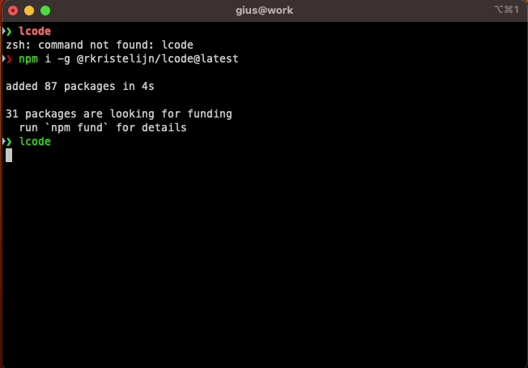

# lcode

[](https://www.npmjs.com/package/@rkristelijn/lcode)
[](https://www.npmjs.com/package/@rkristelijn/lcode)


[](https://github.com/rkristelijn/lcode/actions/workflows/ci.yml)

A lightning-fast CLI tool to search your git repositories and open them in your favorite editor or command.



## ⚡ Performance

**330x faster** than grep for repository discovery. Language filtering adds **zero overhead**.

| Method | Time | Features |
|--------|------|----------|
| `grep -r` | 101s | Content search only |
| `find` | 0.024s | Basic listing |
| **lcode** | **0.31s** | Language detection + README + Caching + Filtering |

[📊 Full Benchmark Report](docs/benchmark.md) • Memory: ~86 MB • Cold start: 0.27s • Cached: 0.31s

## `(◕‿◕)` Features

- `(⌐■_■)` **Lightning Fast**: Smart caching system with 5-minute TTL
- `(╯°□°）╯` **Interactive Mode**: Fuzzy search with autocomplete
- `🔍` **Language Detection**: Automatically detects TypeScript, JavaScript, Python, Java, Kotlin, Go, Rust, and more
- `🎯` **Smart Filtering**: Filter repositories by single or multiple languages
- `ヽ(°〇°)ﾉ` **Automation Ready**: Non-interactive CLI for Amazon Q, CI/CD
- `(¬‿¬)` **Highly Configurable**: Custom paths, commands, and depth settings
- `(╯°□°）╯` **Node Version Management**: Built-in NVM and Nix support
- `(◉◡◉)` **Progress Indicators**: Visual feedback during repository scanning
- `ヽ(´▽`)/` **Production Ready**: 100% test coverage, comprehensive error handling

## `(ﾉ◕ヮ◕)ﾉ*:･ﾟ✧` Quick Start

### Installation

```bash
# Global installation (recommended)
npm install -g @rkristelijn/lcode

# Or use with npx (no installation)
npx @rkristelijn/lcode

# Kiro CLI MCP Integration
kiro-cli mcp add --name "lcode" --command "npx" --args "@rkristelijn/lcode"
```

📖 [Kiro CLI MCP Integration Guide](docs/mcp-integration.md)

### Basic Usage

```bash
# Interactive mode - search and select
lcode

# Search specific directory with custom depth
lcode ~/projects 3

# Non-interactive mode - list all repositories
lcode --list

# Select repository by index
lcode --select 0
```

## `(╯°□°）╯` Usage Guide

### First Time Setup

When you run lcode for the first time, it will automatically prompt you to create a configuration file:

```bash
lcode
# 🔧 No configuration found. Let's set one up!
# ? Would you like to create a configuration file? (Y/n)
```

You can also manually create a configuration:

```bash
lcode --init
```

This will show an interactive setup with these options:

- **Basic setup** - Simple VS Code + terminal setup
- **Node.js with NVM** - Automatic Node version switching
- **Nix development environment** - Nix shell integration  
- **Mixed environments** - Auto-detect Nix/NVM projects
- **Cursor editor** - Alternative to VS Code
- **Custom setup** - Define your own commands

### Interactive Mode (Default)

Perfect for daily development workflow:

```bash
lcode                    # Search current directory
lcode ~/projects         # Search specific directory  
lcode ~ 5               # Search home directory, depth 5
```

### Non-Interactive Mode

Ideal for automation, Amazon Q, and CI/CD:

```bash
# List all repositories with indices
lcode --list
# Output:
# 0: my-awesome-project
# 1: another-project
# 2: third-project

# Select repository by index
lcode --select 0                    # Open first repo with default command
lcode --select 2 "code ."          # Open third repo in VS Code
lcode ~/projects 3 --select 1 zsh  # Custom path, depth, and command
```

### Command Line Arguments

```bash
lcode [path] [maxDepth] [command] [options]
```

**Arguments:**
- `path` - Starting directory (default: current directory)
- `maxDepth` - Search depth 1-10 (default: 3)  
- `command` - Command to execute (default: "code .")

**Options:**
- `--init` - Create configuration file
- `--cleanup` - Remove configuration file
- `--list` - List repositories (non-interactive)
- `--select N` - Select repository by index
- `--lang L` - Filter by language(s) (comma-separated)
- `--help` - Show help information

### Language Filtering

lcode automatically detects the primary language(s) in each repository and displays them:

```bash
# List all repositories with language tags
lcode --list
# Output:
# 0: my-api [ts,js] - REST API service
# 1: data-processor [python] - Data processing pipeline
# 2: mobile-app [kotlin,java] - Android application
# 3: cli-tool [go] - Command line utility

# Filter by single language
lcode --list --lang ts          # Show only TypeScript projects
lcode --list --lang python      # Show only Python projects

# Filter by multiple languages (OR logic)
lcode --list --lang ts,js       # Show TypeScript OR JavaScript projects
lcode --list --lang java,kotlin # Show Java OR Kotlin projects

# Use with select
lcode --lang python --select 0  # Open first Python project
```

**Supported Languages:**
- `ts` - TypeScript (tsconfig.json)
- `js` - JavaScript (package.json)
- `nx` - Nx monorepo (nx.json)
- `python` - Python (requirements.txt, setup.py, Pipfile)
- `java` - Java (pom.xml, build.gradle)
- `kotlin` - Kotlin (build.gradle.kts, settings.gradle.kts)
- `go` - Go (go.mod)
- `rust` - Rust (Cargo.toml)
- `ruby` - Ruby (Gemfile)
- `php` - PHP (composer.json)
- `csharp` - C# (*.csproj)
- `c` - C (Makefile)
- `cpp` - C++ (CMakeLists.txt)
- `other` - No specific language detected

## `(¬‿¬)` Configuration

### Create Configuration File

```bash
lcode --init
```

This creates `~/.lcodeconfig` with these defaults:

```json
{
  "path": "~",
  "maxDepth": 5,
  "execute": "code .",
  "execute2": "zsh", 
  "execute3": "[ -f .nvmrc ] && . ~/.nvm/nvm.sh && nvm use; code ."
}
```

**Advanced users** might prefer this intelligent pattern that auto-detects environments:

```json
{
  "path": "~",
  "maxDepth": 5,
  "execute": "bash -c 'if [ -f flake.nix ]; then nix develop; elif [ -f .nvmrc ]; then . ~/.nvm/nvm.sh && nvm use; fi; zsh'"
}
```

### Configuration Options

| Option | Description | Example |
|--------|-------------|---------|
| `path` | Default search directory | `"~/projects"` |
| `maxDepth` | Maximum search depth (1-10) | `3` |
| `execute` | Primary command | `"code ."` |
| `execute2` | Alternative command | `"zsh"` |
| `execute3` | Advanced command with NVM | `"nvm use && code ."` |

## `ヽ(°〇°)ﾉ` Node Version Management

### NVM (Node Version Manager)

For projects with `.nvmrc` files:

```json
{
  "execute": "[ -f .nvmrc ] && . ~/.nvm/nvm.sh && nvm use; code .",
  "execute2": ". ~/.nvm/nvm.sh && nvm use && npm start",
  "execute3": "nvm use && yarn dev"
}
```

**Common NVM patterns:**
```bash
# Load NVM and use project version, then open VS Code
"[ -f .nvmrc ] && . ~/.nvm/nvm.sh && nvm use; code ."

# Always load NVM, use version, then run command  
". ~/.nvm/nvm.sh && nvm use && your-command"

# Check for .nvmrc first, fallback to default
"[ -f .nvmrc ] && nvm use || nvm use default; code ."
```

### Nix Integration

For Nix-based development environments:

```json
{
  "execute": "nix develop -c code .",
  "execute2": "nix-shell --run 'code .'",
  "execute3": "direnv allow && code ."
}
```

**Nix patterns:**
```bash
# Enter Nix development shell and open editor
"nix develop -c code ."

# Use nix-shell with specific command
"nix-shell --run 'your-command'"

# Use direnv for automatic environment loading
"direnv allow && code ."

# Combine with shell.nix
"nix-shell shell.nix --run 'code .'"
```

### Mixed Environments

For teams using different tools, here's an advanced pattern that automatically detects and uses the right environment:

```json
{
  "path": "~",
  "maxDepth": 5,
  "execute": "bash -c 'if [ -f flake.nix ]; then nix develop; elif [ -f .nvmrc ]; then . ~/.nvm/nvm.sh && nvm use; fi; zsh'"
}
```

This intelligent command:
1. **Checks for `flake.nix`** → enters Nix development shell
2. **Falls back to `.nvmrc`** → loads correct Node.js version with NVM  
3. **Defaults to `zsh`** → opens terminal in project directory

**Other mixed environment patterns:**
```json
{
  "execute": "code .",
  "execute2": "[ -f .nvmrc ] && nvm use; [ -f shell.nix ] && nix develop -c code . || code .",
  "execute3": "direnv allow && code ."
}
```

## `(╯°□°）╯` Real-World Examples

### Development Workflows

```bash
# Quick project switching
lcode --list | grep -i "api"        # Find API projects
lcode --select 2                    # Open the third API project

# Filter by language
lcode --list --lang ts              # List all TypeScript projects
lcode --list --lang python,go       # List Python or Go projects
lcode --lang java --select 0        # Open first Java project

# Batch operations
for i in {0..5}; do lcode --select $i "git pull"; done

# Language-specific operations
lcode --lang ts --list | while read line; do
  index=$(echo $line | cut -d: -f1)
  lcode --select $index "npm audit fix"
done
```

### Amazon Q Integration

```bash
# "Open the second repository in VS Code"
lcode --select 1 "code ."

# "List all my projects"  
lcode --list

# "Show me all TypeScript projects"
lcode --list --lang ts

# "Open the first Python project"
lcode --lang python --select 0

# "Open the project called 'api' in terminal"
lcode --list | grep -n api          # Find index
lcode --select <index> zsh          # Open in terminal
```

### CI/CD Integration

```bash
# GitHub Actions example
- name: Test all repositories
  run: |
    for i in $(seq 0 $(lcode --list | wc -l)); do
      lcode --select $i "npm test" || exit 1
    done
```

## `(⌐■_■)` Performance Tips

- **Caching**: Subsequent searches in the same directory are instant (5-minute cache)
- **Depth Optimization**: Use lower `maxDepth` for faster scans in large directories
- **Ignore Patterns**: Automatically ignores `node_modules`, `build`, `dist`, `.git`, etc.
- **Smart Scanning**: Progress indicators show real-time scanning status

## `ヽ(´▽`)/` Development

### Prerequisites

- Node.js 16+ (tested on 16, 18, 20, 22, 24)
- npm or yarn

### Setup

```bash
git clone https://github.com/rkristelijn/lcode.git
cd lcode
npm install
```

### Testing

```bash
npm test              # Run all tests
npm run test:watch    # Watch mode
npm run lint          # Code linting
```

### Contributing

See [CONTRIBUTING.md](CONTRIBUTING.md) for detailed guidelines.

## `(◉◡◉)` Comparison

| Feature | lcode | Other Tools |
|---------|-------|-------------|
| **Speed** | `(⌐■_■)` Cached + Fast | `(´･ω･`)` Slow scans |
| **Language Detection** | `🔍` Auto-detect 13+ languages | `(╯°□°）╯` Manual tagging |
| **Language Filtering** | `🎯` Multi-language support | `(¬_¬)` Limited or none |
| **Automation** | `ヽ(°〇°)ﾉ` CLI + Interactive | `(╯°□°）╯` Interactive only |
| **Node Management** | `(◕‿◕)` NVM + Nix built-in | `(¬_¬)` Manual setup |
| **Testing** | `ヽ(´▽`)/` 100% coverage | `(・_・?)` Varies |
| **AI Integration** | `(ﾉ◕ヮ◕)ﾉ*:･ﾟ✧` Amazon Q ready | `(╯°□°）╯` Not supported |

## `(¬‿¬)` Links

- [npm Package](https://www.npmjs.com/package/@rkristelijn/lcode)
- [GitHub Repository](https://github.com/rkristelijn/lcode)
- [Issues & Feature Requests](https://github.com/rkristelijn/lcode/issues)
- [Contributing Guide](CONTRIBUTING.md)

## `(◕‿◕)` License

ISC License - see [LICENSE](LICENSE) file for details.

## `ヽ(´▽`)/` Support

If lcode saves you time, consider:
- `(◕‿◕)` [Starring the repository](https://github.com/rkristelijn/lcode)
- `(╯°□°）╯` [Reporting issues](https://github.com/rkristelijn/lcode/issues)
- `(¬‿¬)` [Suggesting features](https://github.com/rkristelijn/lcode/issues/new)
- `ヽ(°〇°)ﾉ` [Sponsoring development](https://github.com/sponsors/rkristelijn)

---

**Made with `ヽ(´▽`)/` by developers, for developers.**
